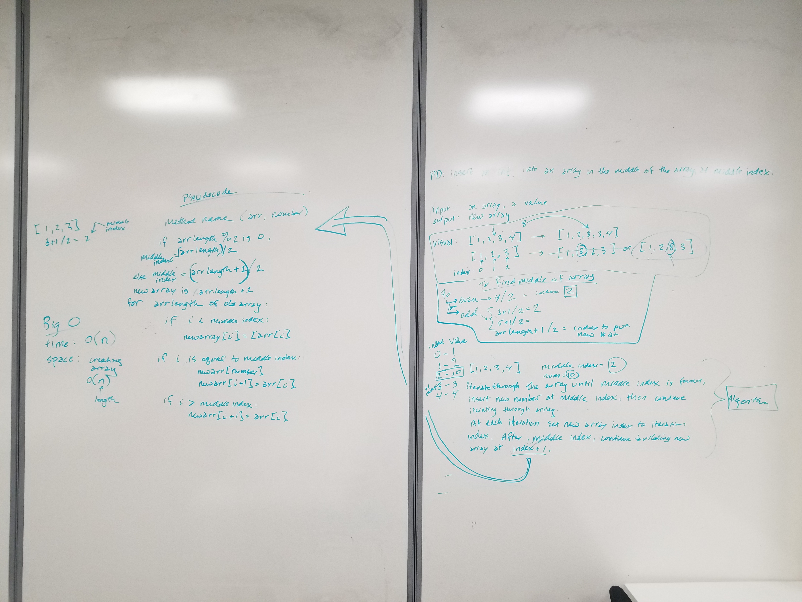

# Reverse an Array
takes an array of numbers and inserts a specified number into the middle
## Challenge
write a method that inserts a specified number into the middle of a specified array

## Approach & Efficiency
<!-- What approach did you take? Why? What is the Big O space/time for this approach? -->
took an appproch of whiteboard then implement ideaology from whiteboard exercise

## Solution
<!-- Embedded whiteboard image -->

