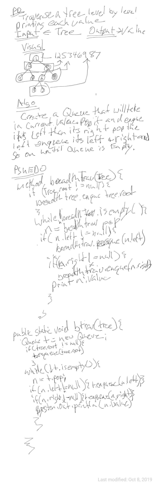

# Breadth First Search

##
##Problem Domain
search each level of a tree and return what looking for

#
##Solution
* Put the root into a queue than put its left and right in and so on and so forth.
* check the first node in the queue for the value being searched for dequeue if not the number and continue the process
## Approach & Efficiency
Recursive approach  O(n) space O(n) time
##Whiteboard pics:

##

[Return to all README's](../README.md) 