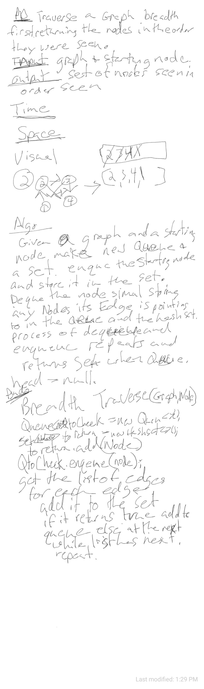

# Breadth First Graph Traversal

##
##Problem Domain
 Using a breadth first traversal, return a collection of nodes in the order they were visited. 
 Display the collection.

#
##Solution
* Add the starting node to a set and a queue.
* Dequeue the queue adding the returned nodes to the set
* if the set returns a boolean of true add them to the queue
* repeat the process for the rest of the nodes
* when the queue is empty return the set of seen nodes.
## Approach & Efficiency
Space O(n)
Time 0(n)?
##Whiteboard pics:

##

[Return to all README's](../../../../../README.md)