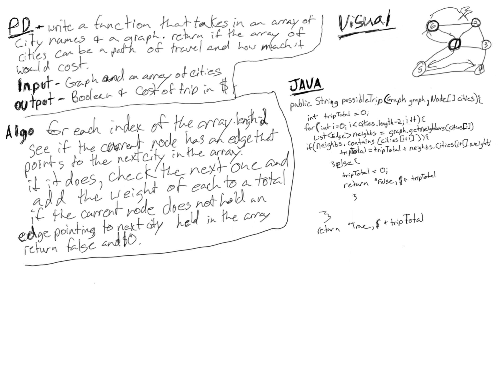

# Get Edges in A Graph

##
##Problem Domain
Given a graph, and an array of city names. Without utilizing any of the built-in methods available to your language, return whether the full trip is possible with direct flights, and how much it would cost.

#
##Solution
* Get a list of edges for the current node and set a counter that takes in the weight of each node processed.
* If the list contains a pointer to the next node in the given array repeat the process for the next array item
* if it makes it through the array return a string of "True $" +counter 
## Approach & Efficiency
O(1) space
O(n) Time
##Whiteboard pics:

##

[Return to all README's](../../../../../README.md)