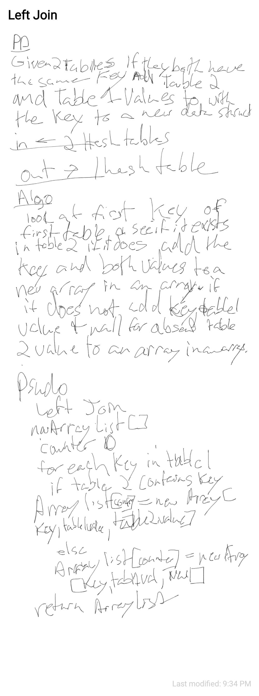

# Left JOin

##
##Problem Domain
Given two hashtables return an data structure that contains the key and value if both tables contain the key add the second tables value to the first table as well else add null.

#
##Solution
* for each key in table one check table two for the same key. if it exists add the value from table two the key and the value from table one to a new datastructure
## Approach & Efficiency
O()
##Whiteboard pics:

##

[Return to all README's](../../../../../README.md)