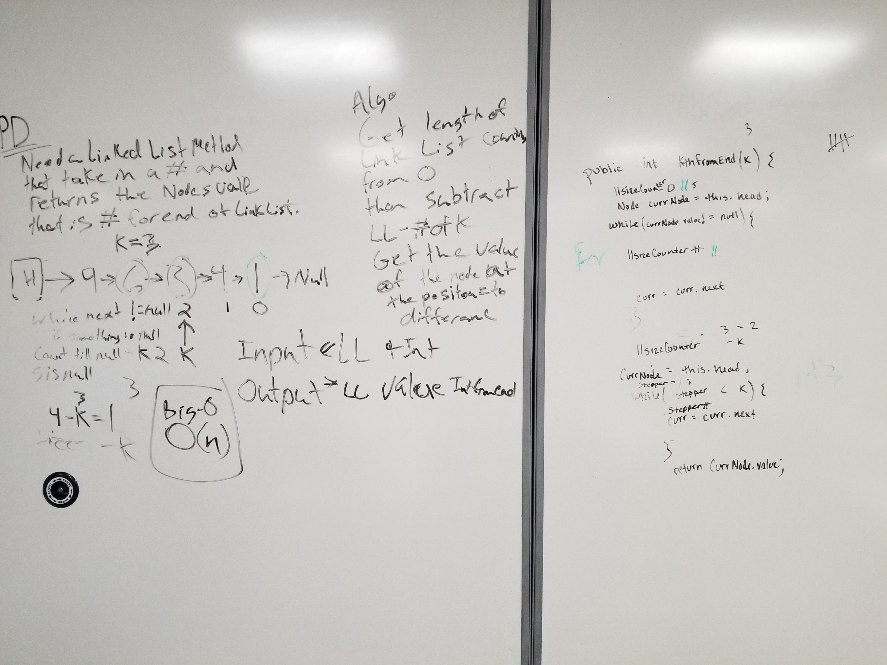

#Code Challenge: Class 07
#####With Jon Veach 9/24/19
##
##Problem Domain
* Given a linked list and an "int k" return the value of the node at "k" from the end.
#
##Solution
* Wrote 2 methods.
    * .size():
      * Which counts the nodes until node.next == null.
    * .kthFromTheLast():
        * Takes in an int "k" and is called on a linked list.
        * Calls .size() and returns NullPointerException if "k" > linkedList.size().
        * Else it will return the value of the node at the index of K from the end of the list.
##
##Whiteboard pics:

##

[Return to all README's](../README.md)