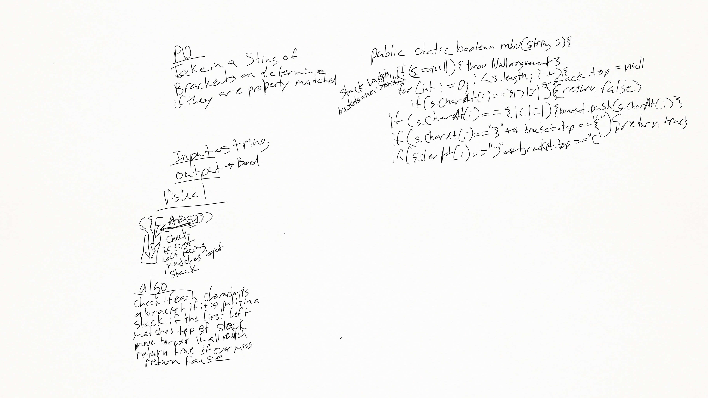

# Multi Bracket Validation

##
##Problem Domain
* Given a string with brackets make sure they all match.
#
##Solution
* put right facing brackets into a stack and check if the first left matches the top. 
if it does pop it and continue. if all match return true else if a mismatch is found return false

##
##Whiteboard pics:

##

[Return to all README's](../../../../../README.md)