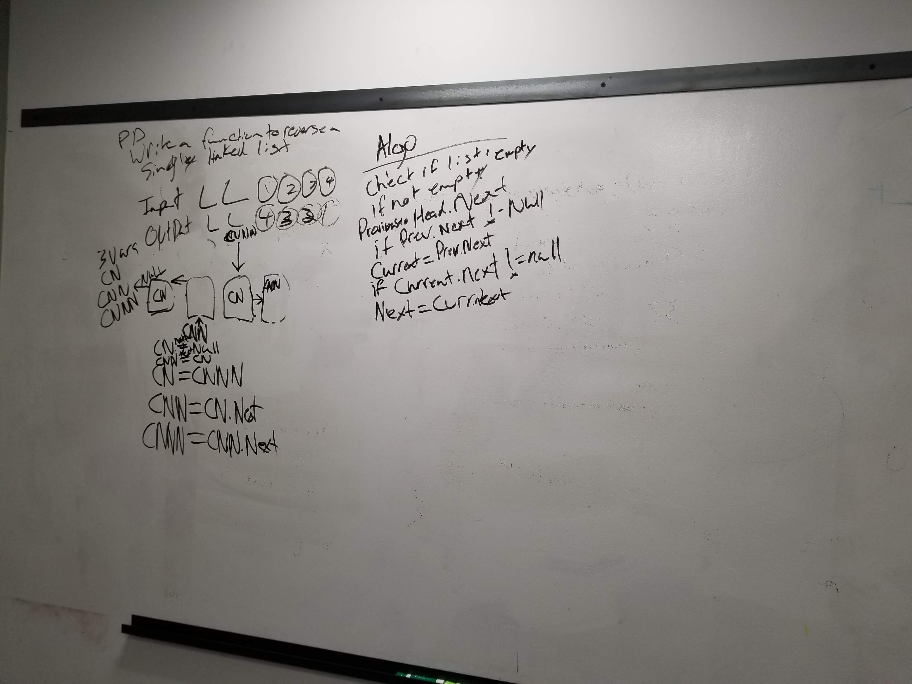

# Merge Linked Lists
<!-- Short summary or background information -->

## Challenge Description
<!-- Description of the challenge -->
take two linked lists and merge together not creating a new list

## Approach & Efficiency
<!-- What approach did you take? Why? What is the Big O space/time for this approach? -->
ended up using michells solution or recurtion

## Solution
<!-- Embedded whiteboard image -->
