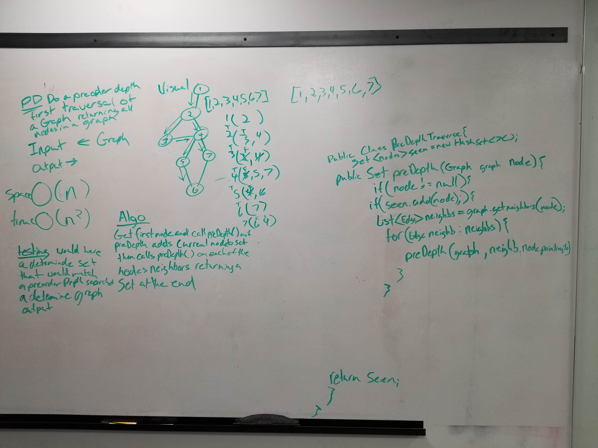

# Pre Order Depth Traversal

##
##Problem Domain
Return all the nodes in a graph in pre-order depth format

#
##Solution
1. Recursively call a function that adds the current node to the set.
2. If the node is added it gets a list of all the edges.
3. it calls the function on each of the nodes in the list.
4. it returns a set of nodes found.
## Approach & Efficiency
* Recursive approach
* O(n2) time
* O(n) space

##Whiteboard pics:

##

[Return to all README's](../../../../../README.md)