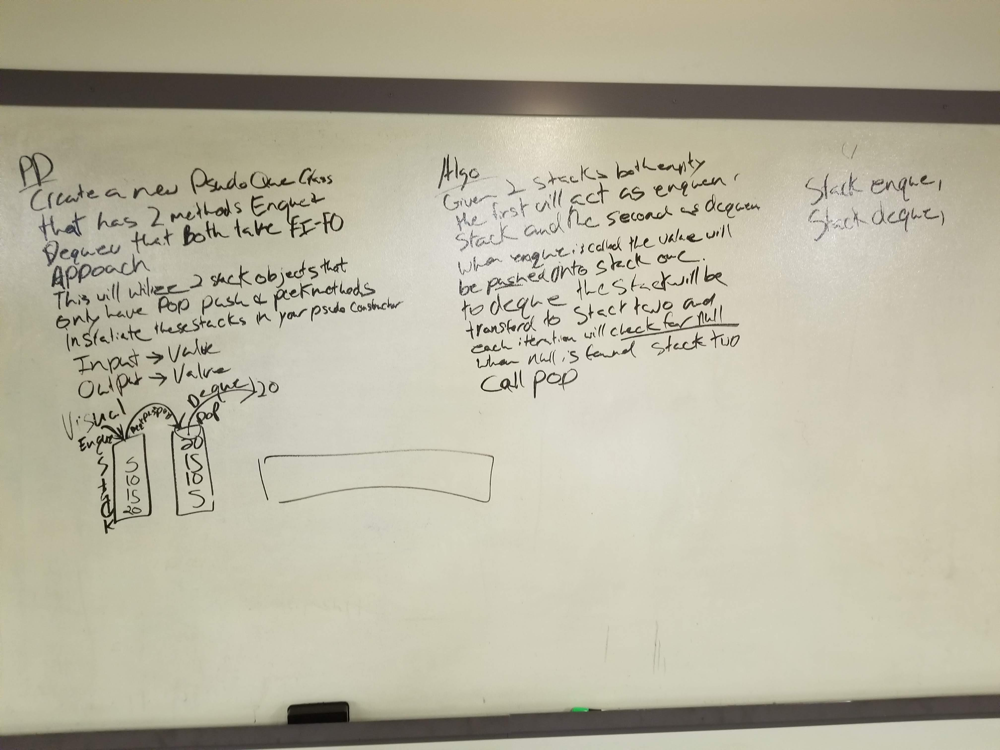

# Psudoqueue 
<!-- Short summary or background information -->
this queue is not the same as a linked list back to front queue this queue utilizes 2 stacks to make the queue

## Challenge Description
<!-- Description of the challenge -->
Given two stacks create a function that utilizes both stacks to work as a queue
## Approach & Efficiency
<!-- What approach did you take? Why? What is the Big O space/time for this approach? -->
I decided that it would be best to have an enqueue and dequeue stack the enqueue stack would hold all the the vals
that had been queued in lifo order up until dequeue is called. Dequeue would shuffle all the nodes into the dequeue stack in fifo order.
Then when dequeue is called while dequeue.peek is not null it will just pop of the top node and enqueue will enqueue normally.

## Solution
<!-- Embedded whiteboard image -->

