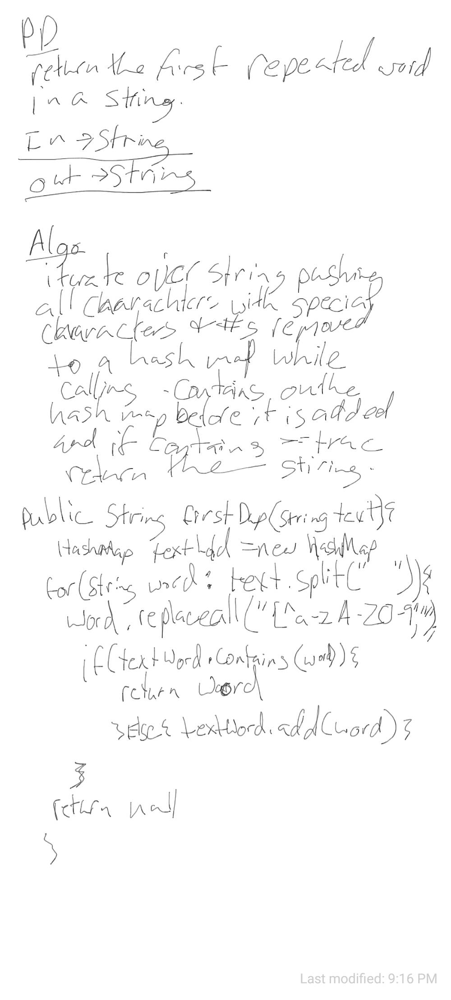

# Repeated Word

##
##Problem Domain
return a word if a duplicate is found in a given string

#
##Solution
Add all words to the hash map without special characters or capitalization
and check if it is in the table before adding it, if it is oin the table return the word
## Approach & Efficiency
O(1)
##Whiteboard pics:

##

[Return to all README's](../../../../../README.md)