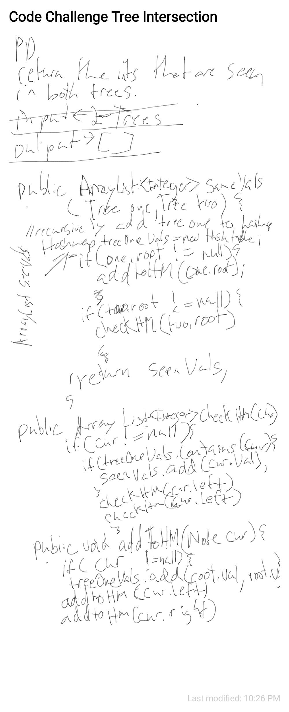

# Tree Intersect

##
##Problem Domain
Return like values in an array as long as they are held in both trees given.

#
##Solution
* recursively add the first tree to a hashtable
* recursively check tree two against the table and add seen values already seen to an array.

## Approach & Efficiency
not sure about space its not o(n2)
I think its O(n) time  

##Whiteboard pics:

##

[Return to all README's](../../../../../README.md)